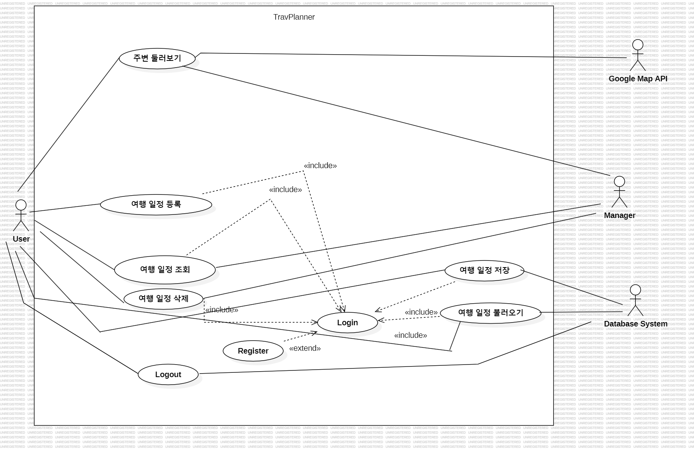
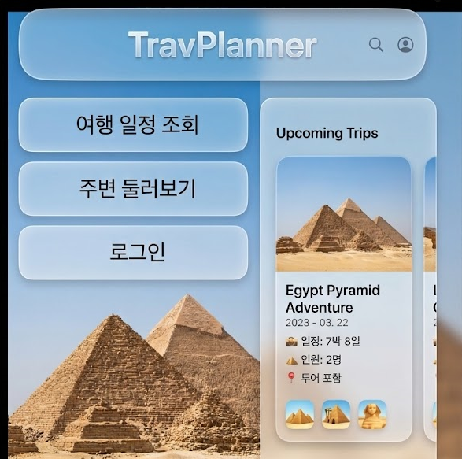
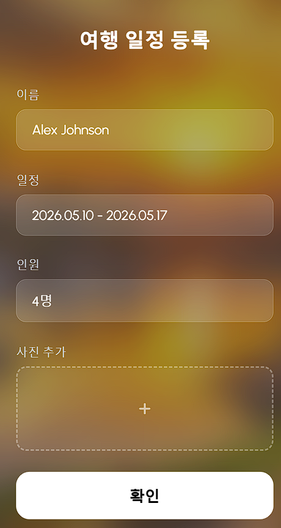

2\. Analysis

TravPlanner - 여행 플래너

22110367

김기현

22110367@ynu.kr

\[ Revision history \]

|     |     |     |     |
| --- | --- | --- | --- |
| **Revision date** | **Version #** | **Description** | **Author** |
| 03/23/2026 | 0.2 |     |     |
| 05/01/2026 | 0.3 | UML로 앱 기초 구현 |     |
|     |     |     |     |
|     |     |     |     |
|     |     |     |     |
|     |     |     |     |

\= Contents =

1.  Introduction ...........................................................................................

2\. Use case analysis ....................................................................................

3\. Domain analysis .........................................................................................

4\. User Interface prototype ............................................................................

5\. Glossary ......................................................................................................

6\. References .................................................................................................

1.  Introduction

여행을 다닐 때 여행 관련 여러 앱을 동시에 사용하며 생기는 불편함을 최소화하기 위해 여행 중 발생하는 Case들을 모두 하나의 앱으로 통합한 TravPlanner - 여행 플래너는 지난 개념화 문서에서 이 앱 시스템의 요구사항들을 다루었다. 이 보고서는 지난번의 시스템 요구사항들을 토대로 하여 ‘시스템이 무엇을 하는가’에 맞추어 Use Case, Domain, Application 분석 및 preliminary use manual과 사용자 Interface를 소개할 것이다. 각각의 장에서 UML을 사용하여 분석할 것이다. 이 보고서를 통해 이 앱의 목적성과 방향성을 알 수 있을 것이다.

2\. Use case analysis

2.1 Use case diagram

2.2 Use case Description

|     |     |
| --- | --- |
| Use Case #1 : Login |     |
| GENERAL CHARACTERSTICS |     |
| Summary | 사용자가 ID와 PASSWORD를 입력하여 로그인 성공 또는 실패 여부를 확인하는 기능 |
| Scope | Travplanner – 여행 플래너 |
| Level | User Level |
| Author |     |
| Last Update |     |
| Status | Analysis |
| Primary Actor | User |
| Preconditions | 사용자는 회원가입을 완료한 상태여야 한다.  인터넷 통신이 가능해야 한다. |
| Trigger | 온라인 상태로 서비스를 이용하거나 여행 일정 저장. 여행 일정 불러오기 시스템을 사용할 때 |
| Sucess Post Condition | 사용자는 로그인에 성공한다.  로그인에 성공하면 회원가입을 제외한 모든 기능을 사용할 수 있다. |
| Failed Post Condition | 사용자는 로그인에 실패한다.  회원가입 기능이 활성화되어 있다. |
| MAIN SUCCESS SCENARIO |     |
| STEP | ACTION |
| S   | 사용자가 Travplanner에 로그인할 때 시작 |
| 1   | 사용자는 로그인 화면에서 아이디와 비밀번호를 입력한 뒤 로그인 버튼을 누른다. |
| 2   | 시스템은 Database system과 비교하여 회원 정보가 올바른지 확인한다.  등록된 회원이라면 로그인에 성공하고 온라인 기능을 활성화한다. |
| 3   | 이 Use case는 로그인이 성공하면 끝난다. |
| EXTENSION SCENARIOS |     |
| STEP | BRANCHING ACTION |
| 2   | 2-a : 아이디 또는 비밀번호가 잘못되어 로그인에 실패하는 이유   2-a-가 : &lt;아이디 또는 비밀번호가 불일치하여 로그인에 실패하였습니다&gt;라는 메시지 창을 띄운다.  2-b : 아이디 또는 비밀번호가 입력되지 않은 경우  2-b-가 : &lt;아이디 또는 비밀번호가 입력되지 않았습니다. 다시 입력하시기 바랍니다.&gt;라는 메시지 창을 띄운다. |
| RELATED INFORMATION |     |
| Performance | 5초 이내 |
| Frequency | 사용자당 한 달에 한번 |

|     |     |
| --- | --- |
| Use Case #2 : Logout |     |
| GENERAL CHARACTERSTICS |     |
| Summary | 사용자가 로그인된 상태에서 벗어나 로그아웃할 때 사용하는 기능 |
| Scope | Travplanner – 여행 플래너 |
| Level | User Level |
| Author |     |
| Last Update |     |
| Status | Analysis |
| Primary Actor | User |
| Preconditions | 사용자는 로그인 상태여야 한다.  인터넷 통신이 가능해야 한다. |
| Trigger | 메뉴 화면에서 로그아웃 버튼을 눌러서 로그아웃을 시도할 때 |
| Sucess Post Condition | 사용자는 로그아웃에 성공한다. |
| Failed Post Condition | 사용자는 로그아웃에 실패한다. |
| MAIN SUCCESS SCENARIO |     |
| STEP | ACTION |
| S   | 사용자가 Travplanner에서 로그아웃을 시도하여 로그아웃 버튼을 누른다. |
| 1   | 시스템은 로그아웃의 성공을 판단하며, 온라인 기능을 비활성화하고, 로그인 화면을 메뉴 하단에 표시한다. |
| 2   | 이 Use case는 로그인이 성공하면 끝난다. |
| EXTENSION SCENARIOS |     |
| STEP | BRANCHING ACTION |
| 2   | 2-a : 통신에 문제가 있어 로그아웃이 실패한 경우  2-a-가 : &lt;로그아웃이 실패하였습니다. 재시도하시겠습니까?&gt;메시지를 띄우고 로그아웃을 재시도할지의 여부를 사용자에게 질문한다. |
| RELATED INFORMATION |     |
| Performance | 5초 이내 |
| Frequency | 사용자당 한 달에 한번 |
| Concurrency | None |
| Due Date |     |

|     |     |
| --- | --- |
| Use Case #3 : Register |     |
| GENERAL CHARACTERSTICS |     |
| Summary | 사용자가 온라인 기능을 사용하기 위해 회원가입할 때 사용하는 기능 |
| Scope | Travplanner – 여행 플래너 |
| Level | User Level |
| Author |     |
| Last Update |     |
| Status | Analysis |
| Primary Actor | User |
| Preconditions | 사용자는 로그아웃 상태여야 한다.  데이터베이스 시스템과 통신이 가능해야 한다. |
| Trigger | 로그인 메뉴에서 회원가입 버튼을 눌러 회원가입을 시도할 때 |
| Sucess Post Condition | 사용자는 회원가입에 성공한다. 회원가입에 성공한 사용자는 회원가입을 시도했던 정보로 바로 로그인된다. |
| Failed Post Condition | 사용자는 회원가입에 실패한다. |
| MAIN SUCCESS SCENARIO |     |
| STEP | ACTION |
| S   | 사용자가 Travplanner에 회원가입을 시도한다. |
| 1   | 사용자는 로그인 메뉴에서 회원가입 버튼을 누른다. |
| 2   | 시스템은 회원가입 창을 띄운다. |
| 3   | 사용자는 약관에 동의한다. 동의하지 않을 시 회원가입은 실패한다. |
| 4   | 사용자는 정보를 입력 후 확인 버튼을 누른다. |
| 5   | 시스템은 데이터베이스에 회원 정보가 추가되어 회원가입이 성공했는지 판단한다. 성공했다면 바로 그 정보로 로그인한다. |
| 6   | 이 Use Case는 회원가입이 성공하면 끝난다. |
| EXTENSION SCENARIOS |     |
| STEP | BRANCHING ACTION |
| 3   | 3-a : 약관 동의를 거부한 경우  3-a-가 : &lt;약관 동의에 거부할 시 회원가입하실 수 없습니다.&gt;메시지를 띄우고 약관에 동의할지의 여부를 사용자에게 질문한다. |
| 4   | 4-b : 중복된 아이디가 존재하는 경우  4-b-가 : &lt;중복된 아이디입니다. 재입력바랍니다.&gt;라는 메시지를 띄운다.  5-b : 비밀번호와 비밀번호 확인이 다른 경우  5-b-가 : &lt;비밀번호가 정확하게 입력되었는지 확인 바랍니다.&gt;라는 메시지를 띄운다.  5-c : 비어있는 입력 정보가 있는 경우  5-c-가 : &lt;비어있는 입력란이 있습니다. 입력 바랍니다.&gt;라는 메시지를 띄운다. |
| RELATED INFORMATION |     |
| Performance | 5초 이내 |
| Frequency | 사용자당 1번 |
| Concurrency | None |
| Due Date |     |

|     |     |
| --- | --- |
| Use Case #4 : 여행 일정 등록 |     |
| GENERAL CHARACTERSTICS |     |
| Summary | 사용자가 여행 일정을 등록하는 기능 |
| Scope | Travplanner – 여행 플래너 |
| Level | User Level |
| Author |     |
| Last Update |     |
| Status | Analysis |
| Primary Actor | User |
| Preconditions | 앱이 성공적으로 실행된 상태이어야 한다.  &lt;여행 일정 조회&gt; 메뉴에 있는 상태이어야 한다. |
| Trigger | &lt;여행 일정 조회&gt;메뉴에서 최하단의 &lt;+&gt;버튼을 누를 때 |
| Sucess Post Condition | 사용자는 여행 일정 등록에 성공한다. 등록에 성공한 여행 일정은 &lt;여행 일정 조회&gt;에서 찾아볼 수 있다. |
| Failed Post Condition | 사용자는 여행 일정 등록에 실패한다. 등록에 실패한 여행 일정은 재등록을 시도할 수 있다. |
| MAIN SUCCESS SCENARIO |     |
| STEP | ACTION |
| S   | 사용자가 Travplanner에 여행 일정 등록을 시도한다. |
| 1   | 사용자는 &lt;여행 일정 조회&gt; 메뉴에서 최하단의 &lt;+&gt;버튼을 누른다. |
| 2   | 시스템은 여행 일정 등록 창을 연다. |
| 4   | 사용자는 여행 일정 정보를 입력 후 확인 버튼을 누른다. |
| 5   | 시스템은 로컬 데이터베이스에 여행 일정이 추가되었는지 확인한다. |
| 6   | 이 Use Case는 회원가입이 성공하면 끝난다. |
| EXTENSION SCENARIOS |     |
| STEP | BRANCHING ACTION |
| 5   | 3-a : 확인 버튼을 눌렀으나 여행 일정 등록이 실패한 경우  3-a-가 : &lt;여행 일정 등록이 실패하였습니다. 재시도하시겠습니까?&gt;메시지를 띄우고 재시도할지의 여부를 사용자에게 질문한다. |
| RELATED INFORMATION |     |
| Performance | 5초 이내 |
| Frequency | 사용자당 1일 5번 |
| Concurrency | None |
| Due Date |     |

|     |     |
| --- | --- |
| Use Case #5 : 여행 일정 조회 |     |
| GENERAL CHARACTERSTICS |     |
| Summary | 사용자가 여행 일정을 등록하는 기능 |
| Scope | Travplanner – 여행 플래너 |
| Level | User Level |
| Author |     |
| Last Update |     |
| Status | Analysis |
| Primary Actor | User |
| Preconditions | 앱이 성공적으로 실행된 상태이어야 한다.  &lt;여행 일정 조회&gt; 메뉴에 있는 상태이어야 한다. |
| Trigger | &lt;여행 일정 조회&gt;메뉴에서 최하단의 &lt;+&gt;버튼을 누를 때 |
| Sucess Post Condition | 사용자는 여행 일정 등록에 성공한다. 등록에 성공한 여행 일정은 &lt;여행 일정 조회&gt;에서 찾아볼 수 있다. |
| Failed Post Condition | 사용자는 여행 일정 등록에 실패한다. 등록에 실패한 여행 일정은 재등록을 시도할 수 있다. |
| MAIN SUCCESS SCENARIO |     |
| STEP | ACTION |
| S   | 사용자가 Travplanner에 여행 일정 등록을 시도한다. |
| 1   | 사용자는 &lt;여행 일정 조회&gt; 메뉴에서 최하단의 &lt;+&gt;버튼을 누른다. |
| 2   | 시스템은 여행 일정 등록 창을 연다. |
| 4   | 사용자는 여행 일정 정보를 입력 후 확인 버튼을 누른다. |
| 5   | 시스템은 로컬 데이터베이스에 여행 일정이 추가되었는지 확인한다. |
| 6   | 이 Use Case는 회원가입이 성공하면 끝난다. |
| EXTENSION SCENARIOS |     |
| STEP | BRANCHING ACTION |
| 5   | 3-a : 확인 버튼을 눌렀으나 여행 일정 등록이 실패한 경우  3-a-가 : &lt;여행 일정 등록이 실패하였습니다. 재시도하시겠습니까?&gt;메시지를 띄우고 재시도할지의 여부를 사용자에게 질문한다. |
| RELATED INFORMATION |     |
| Performance | 5초 이내 |
| Frequency | 사용자당 1일 5번 |
| Concurrency | None |
| Due Date |     |

|     |     |
| --- | --- |
| Use Case #6 : 여행 일정 삭제 |     |
| GENERAL CHARACTERSTICS |     |
| Summary | 사용자가 여행 일정을 삭제하는 기능 |
| Scope | Travplanner – 여행 플래너 |
| Level | User Level |
| Author |     |
| Last Update |     |
| Status | Analysis |
| Primary Actor | User |
| Preconditions | 앱이 성공적으로 실행된 상태이어야 한다.  &lt;여행 일정 조회&gt; 메뉴에 있는 상태이어야 한다. |
| Trigger | &lt;여행 일정 조회&gt;메뉴에서 최하단의 &lt;-&gt;버튼을 누를 때 |
| Sucess Post Condition | 사용자는 여행 일정 삭제에 성공한다. 삭제에 성공한 여행 일정은 &lt;여행 일정 조회&gt; 데이터베이스에서 삭제되어 더 이상 표시되지 않는다. |
| Failed Post Condition | 사용자는 여행 일정 삭제에 실패한다. 삭제에 실패한 여행 일정은 삭제를 재시도할 수 있다. |
| MAIN SUCCESS SCENARIO |     |
| STEP | ACTION |
| S   | 사용자가 Travplanner에 여행 일정 삭제를 시도한다. |
| 1   | 사용자는 &lt;여행 일정 조회&gt; 메뉴에서 최하단의 &lt;-&gt;버튼을 누른다. |
| 2   | 시스템은 삭제 여부를 사용자에게 질문한다. |
| 3   | 사용자는 확인 버튼을 누른다. |
| 4   | 시스템은 로컬 데이터베이스에서 해당 여행 일정을 삭제한다. |
| 5   | 이 Use Case는 여행 일정 삭제가 성공하면 끝난다. |
| EXTENSION SCENARIOS |     |
| STEP | BRANCHING ACTION |
| 3   | 3-a : 확인 버튼을 눌렀으나 여행 일정 등록이 실패한 경우  3-a-가 : &lt;여행 일정 삭제가 실패하였습니다. 재시도하시겠습니까?&gt;메시지를 띄우고 재시도할지의 여부를 사용자에게 질문한다. |
| RELATED INFORMATION |     |
| Performance | 3초 이내 |
| Frequency | 사용자당 1일 1번 |
| Concurrency | None |
| Due Date |     |

|     |     |
| --- | --- |
| Use Case #7 : 주변 둘러보기 |     |
| GENERAL CHARACTERSTICS |     |
| Summary | 사용자가 현 위치 주변의 여행 장소를 검색하는 기능 |
| Scope | Travplanner – 여행 플래너 |
| Level | User Level |
| Author |     |
| Last Update |     |
| Status | Analysis |
| Primary Actor | User |
| Preconditions | 앱이 성공적으로 실행된 상태이어야 한다.  &lt;여행 일정 조회&gt; 메뉴에 있는 상태이어야 한다. |
| Trigger | &lt;여행 일정 조회&gt;메뉴에서 &lt;주변 둘러보기&gt;버튼을 누를 때 |
| Sucess Post Condition | 사용자는 현 위치 주변의 여행 장소를 볼 수 있다. |
| Failed Post Condition | 지도를 불러올 수 없다. |
| MAIN SUCCESS SCENARIO |     |
| STEP | ACTION |
| S   | 사용자가 Travplanner에서 주변 둘러보기 기능을 사용한다. |
| 1   | 사용자는 &lt;여행 일정 조회&gt; 메뉴에서 &lt;주변 둘러보기&gt;버튼을 누른다. |
| 2   | 시스템은 기기의 위치 권한을 획득한다. |
| 3   | 시스템은 Google Map의 API를 이용하여, 현 위치 주변의 여행 장소들을 조회하여 보여준다. |
| 4   | 사용자는 Google Map에서 현 위치 주변의 여행 장소들을 알 수 있다. |
| 5   | 이 Use Case는 사용자가 현 위치 주변의 여행 장소들을 확인하면 끝난다. |
| EXTENSION SCENARIOS |     |
| STEP | BRANCHING ACTION |
| 2   | 2-a : 기기의 위치 권한 획득이 실패한 경우  2-a-가 : &lt;위치 권한 획득이 실패하였습니다. 위치 권한 획득 시스템 설정으로 이동하시겠습니까?&gt;메시지를 띄우고 OS의 위치 권한 부여 시스템 설정창으로 이동할지의 여부를 질문한다. |
| 3   | 3-a : Google Map을 불러올 수 없을 때  3-a-가 : &lt;지도를 불러올 수 없습니다. 재시도하시겠습니까?&gt;메시지를 띄우고 재시도할지의 여부를 사용자에게 질문한다 |
| RELATED INFORMATION |     |
| Performance | 3초 이내 |
| Frequency | 사용자당 1일 7번 |
| Concurrency | None |
| Due Date |     |

3\. Domain analysis

1)Post_D

여행 일정 게시글 클래스이다. 게스글을 보여줄 때 필요한 데이터를 가진다.

2)User_D

사용자 클래스이다. 회원가입을 할 때 값을 저장하고 회원 정보를 표시하는 클래스다.

3)Location_D

위치정보 클래스이다. 위도 및 경도 정보를 가진다.

4)Auth

로그인과 회원가입, 로그아웃 역할을 하는 클래스이다. 시스템을 사용하려는 회원을 판별하고 그 결과를 시스템에 통보하며 오류가 있다면 사용자에게 오류를 통보한다.

5)Post

여행 일정을 관리하는 클래스이다. 여행 일정 등록, 삭제를 할 수 있다. 과정 중 오류가 발생할 경우 사용자에게 오류를 통보한다.

6)Map

위치정보를 설정하는 클래스이다. 사용자의 현재 위치를 Google Map에 표시한다.

4\. User Interface prototype

4.1 메인 및 메뉴 화면

앱에 접속한 이후 메인 화면이다. ‘여행 일정 조회’ 메뉴가 기본적으로 선택되어 있다.

4.2 ‘여행 일정 조회’ 화면

‘여행 일정 조회’ 단독 화면이다. &lt;+&gt; 버튼으로 여행 일정을 추가하고 &lt;-&gt; 버튼으로 여행 일정을 삭제할 수 있다.

4.3 ‘여행 일정 등록‘ 화면

&lt;+&gt; 버튼을 눌렀을 때 나타나는 &lt;여행 일정 등록&gt; 화면이다.

4.4 ’로그인‘ 화면

&lt;메뉴&gt;에서 &lt;로그인&gt;버튼을 누르면 나오는 &lt;로그인&gt;화면이다. ‘회원가입’ 버튼을 누르면 회원가입 화면으로 이동한다.(4.6 참조)

4.5 ‘주변 둘러보기’ 화면

&lt;메뉴&gt;에서 &lt;주변 둘러보기&gt; 버튼을 누르면 나오는 &lt;주변 둘러보기&gt; 화면이다.

Google Map을 불러와 현 위치 주변의 여행 정보를 알 수 있다.

4.6 ‘회원가입’ 화면

앱에서 ‘회원가입’버튼을 눌렀을 때 나오는 ‘회원가입’화면이다.

5\. Glossary

|     |     |
| --- | --- |
| Term | Description |
| TravPlanner | 여행 중 여행 관련 정보를 통합하여 찾아볼 수 있는 다목적 애플리케이션 |
| 유저  | 애플리케이션을 사용하는 여행자 |
| 여행 일정 | 유저가 등록한 여행 일정 |

6\. References

Google Maps API - https://mapsplatform.google.com/lp/maps-apis/
