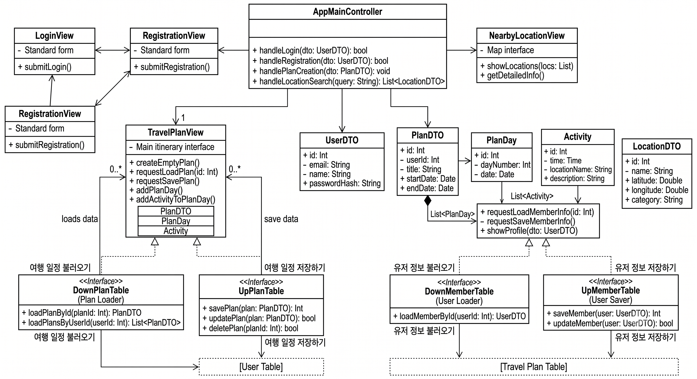
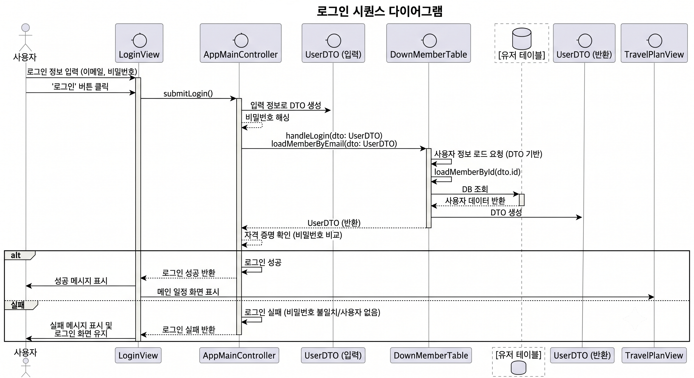
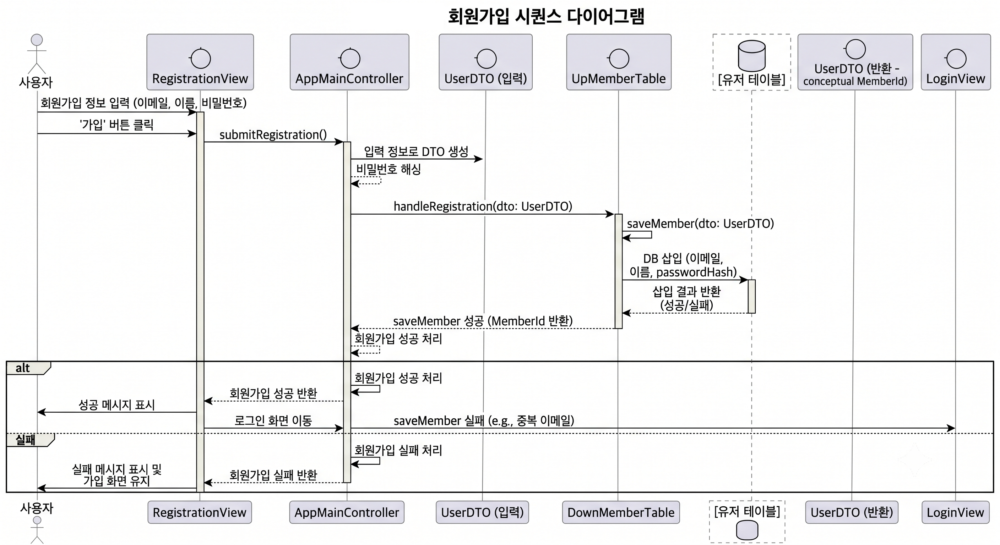
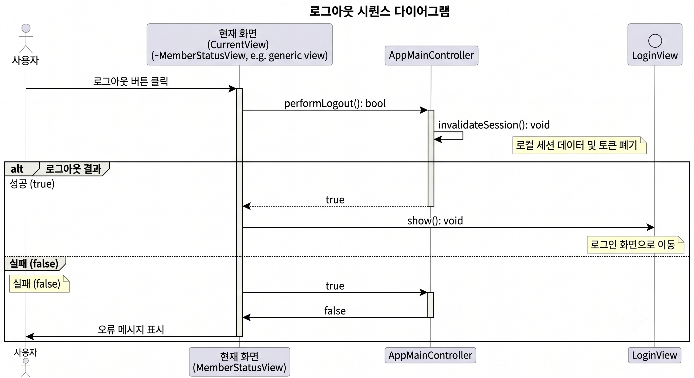
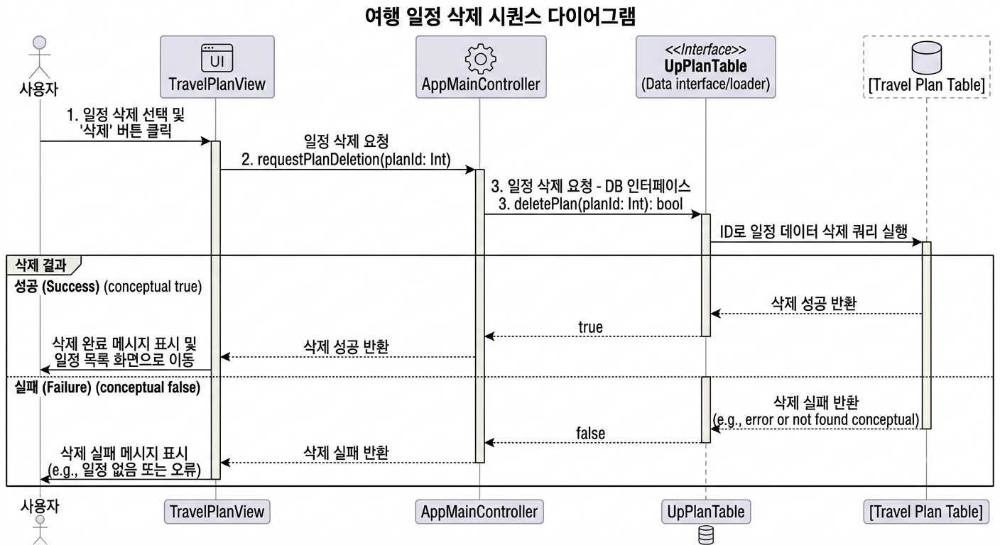
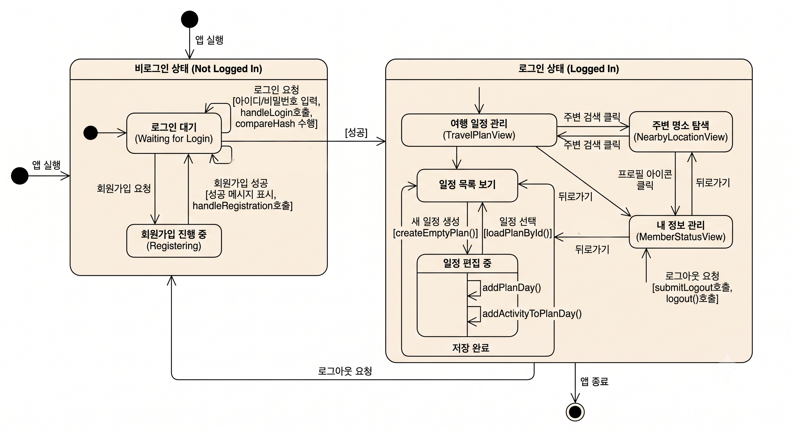

3\. Design

TravPlanner - 여행 플래너

22110367

김기현

22110367@ynu.kr

\[ Revision history \]

|     |     |     |     |
| --- | --- | --- | --- |
| **Revision date** | **Version #** | **Description** | **Author** |
| 06/05/2026 | 1.00 | First Draft | 김기현 |
|     |     |     |     |
|     |     |     |     |
|     |     |     |     |
|     |     |     |     |
|     |     |     |     |

\= Contents =

1.  Introduction ..........................................................................................

2\. Class diagram ........................................................................................

3\. Sequence diagram ..................................................................................

4\. State machine diagram ............................................................................

5\. Implementation requirements ...................................................................

6\. Glossary ....................................................................................................

7\. References .................................................................................................

1.  Introduction

여행을 다닐 때 여행 관련 여러 앱을 동시에 사용하며 생기는 불편함을 최소화하기 위해 여행 중 발생하는 Case들을 모두 하나의 앱으로 통합한 TravPlanner – 이 문제는 세 번째 단계인 Design에 대한 내용이고, 실 구현에 대한 세부적인 사항 명시 및 Diagram을 통해 시스템의 전반적인 모습을 시각화, 순서화하여 보여준다.

2\. Class diagram

1\. AppMainController (앱 메인 컨트롤러)

앱의 전반적인 비즈니스 로직과 흐름을 제어하는 핵심 클래스

handleLogin : 사용자 로그인 요청을 처리하고 성공 여부를 반환

handleRegistration : 회원가입 요청을 처리하고 성공 여부를 반환.

handlePlanCreation : 새로운 여행 일정 생성을 처리.

handleLocationSearch(query: String): List&lt;LocationDTO&gt; : 검색어를 입력받아 주변 위치 정보를 검색하고 결과 목록을 반환.

2\. LoginView (로그인 화면)

사용자가 로그인할 수 있는 화면 인터페이스를 담당.

Standard form : 아이디, 비밀번호 등을 입력받는 로그인 양식 속성.

submitLogin() : 사용자가 입력한 정보를 기반으로 로그인 요청을 전송하는 메서드.

3\. RegistrationView (회원가입 화면)

새로운 사용자가 서비스에 가입할 수 있는 화면 인터페이스를 담당.

Standard form : 이메일, 이름, 비밀번호 등을 입력받는 회원가입 양식 속성.

submitRegistration() : 입력된 회원가입 정보를 서버나 컨트롤러로 전송하는 메서드.

4\. NearbyLocationView (주변 둘러보기 화면)

사용자의 현재 위치나 특정 지역 주변의 관광지, 식당 등의 명소를 보여주는 화면.

Map interface : 지도를 표시하고 상호작용하기 위한 지도 인터페이스 속성.

showLocations(locs: List) : 검색된 주변 위치 목록을 화면(또는 지도)에 표시하는 메서드.

getDetailedInfo() : 선택한 특정 장소의 상세 정보를 가져오는 메서드.

5\. TravelPlanView (여행 일정 화면)

사용자가 자신의 여행 일정을 조회하고, 편집하고, 관리하는 메인 일정 인터페이스 화면.

Main itinerary interface : 전체적인 여행 일정 일자별 타임라인을 보여주는 메인 인터페이스 속성.

createEmptyPlan() : 새로운 빈 여행 일정을 생성.

requestLoadPlan(id: Int) : 저장된 특정 여행 일정 ID를 기반으로 일정을 불러오도록 요청.

requestSavePlan() : 현재 작성 중인 여행 일정을 저장하도록 요청.

addPlanDay() : 여행 일정에 새로운 '일차(Day)'를 추가 (예: 1일차, 2일차 추가).

addActivityToPlanDay() : 특정 일차에 세부 활동(방문지, 시간 등)을 추가.

6\. UserDTO (유저 데이터 전달 객체)

유저(회원) 정보를 시스템 계층 간에 전달하기 위한 데이터 구조.

id: Int : 고유 유저 번호 (식별자).

email: String : 유저의 이메일 주소 (아이디 대용).

name: String : 유저의 이름(닉네임).

passwordHash: String : 보안을 위해 암호화된 비밀번호 해시값.

7\. PlanDTO (여행 일정 데이터 전달 객체)

하나의 큰 여행 일정 전체 정보를 담고 있는 데이터 구조. (내부에 일자별 일정 목록인 List&lt;PlanDay&gt;를 포함.)

id: Int : 고유 여행 일정 번호 (식별자).

userId: Int : 이 일정을 작성한 유저의 고유 번호.

title: String : 여행 일정의 제목 (예: "3박 4일 제주도 힐링 여행").

startDate: Date : 여행 시작일.

endDate: Date : 여행 종료일.

8\. PlanDay (일자별 일정 객체)

여행 중 특정 '하루'의 정보를 담는 클래스. (내부에 당일 세부 활동 목록인 List&lt;Activity&gt;를 포함.)

id: Int : 고유 일자 번호.

dayNumber: Int : 몇 번째 날인지를 나타내는 일차 항목 (예: 1일차, 2일차).

date: Date : 해당 일차의 실제 날짜.

9\. Activity (세부 활동 객체)

특정 일차 내에서 이루어지는 구체적인 일정 항목(방문지, 식사 등)을 나타냄.

id: Int : 고유 활동 번호.

time: Time : 방문 또는 활동 예정 시간.

locationName: String : 장소 명칭 (예: "성산일출봉", "A 레스토랑").

description: String : 해당 활동에 대한 메모나 설명.

10\. LocationDTO (위치 정보 데이터 전달 객체)

'주변 둘러보기' 등에서 활용되는 지도상의 장소 정보를 담는 데이터 구조.

id: Int : 고유 장소 번호.

name: String : 장소의 이름.

latitude: Double : 장소의 위도 좌표.

longitude: Double : 장소의 경도 좌표.

category: String : 장소의 분류(예: 관광지, 맛집, 숙소 등).

\[데이터베이스 인터페이스 계층 (DB 입출력)\]

다이어그램 하단에 위치한 인터페이스들로, 외부 저장소(데이터베이스/테이블)와 앱 간의 데이터 이동을 담당.

11\. <> DownPlanTable (여행 일정 불러오기 인터페이스)

데이터베이스로부터 여행 일정 데이터를 조회해 오는 기능(Plan Loader)을 정의.

loadPlanById(planId: Int): PlanDTO : 일정 ID를 기반으로 특정 여행 일정 정보를 데이터베이스에서 읽어.

loadPlansByUserId(userId: Int): List&lt;PlanDTO&gt; : 특정 유저 ID가 보유한 모든 여행 일정 목록을 읽음.

12\. <> UpPlanTable (여행 일정 저장하기 인터페이스)

여행 일정 데이터를 데이터베이스에 기록하고 변경하는 기능(Plan Saver)을 정의.

savePlan(plan: PlanDTO): Int : 새로운 여행 일정을 데이터베이스에 저장하고, 생성된 일정 ID를 반환.

updatePlan(plan: PlanDTO): bool : 기존의 수정된 여행 일정 내용을 데이터베이스에 업데이트하고 성공 여부를 반환.

deletePlan(planId: Int): bool : 특정 여행 일정을 데이터베이스에서 삭제하고 성공 여부를 반환.

13\. <> DownMemberTable (유저 정보 불러오기 인터페이스)

데이터베이스로부터 사용자(회원) 정보를 조회해 오는 기능(User Loader)을 정의.

loadMemberById(userId: Int): UserDTO : 고유 유저 ID를 기반으로 유저의 상세 프로필 정보를 데이터베이스에서 불러옴.

requestLoadMemberInfo(id: Int) : 유저 정보 로드를 요청하는 트리거 메서드.

showProfile(dto: UserDTO) : 불러온 유저 정보를 화면(MemberStatus/회원정보창)에 표기할 수 있도록 전달.

14\. <> UpMemberTable (유저 정보 저장하기 인터페이스)

사용자(회원) 정보를 데이터베이스에 신규 등록하거나 수정하는 기능(User Saver)을 정의.

saveMember(user: UserDTO): Int : 신규 회원 가입 정보를 데이터베이스에 저장하고 생성된 회원 ID를 반환.

updateMember(user: UserDTO): bool : 회원 정보 수정(비밀번호 변경, 닉네임 변경 등) 사항을 데이터베이스에 업데이트하고 성공 여부를 반환.

requestSaveMemberInfo() : 유저 정보 저장을 요청하는 트리거 메서드.

3\. Sequence diagram

1\. 로그인 (Login) 기능

사용자가 LoginView에 이메일과 비밀번호를 입력하고 로그인 버튼을 클릭하여 인증을 요청.

AppMainController는 입력 정보를 바탕으로 비밀번호를 해싱한 후, DownMemberTable에 해당 이메일의 유저 조회를 요청.

데이터베이스에서 사용자 데이터를 조회하여 UserDTO 형태로 컨트롤러에 반환.

컨트롤러는 입력된 정보와 데이터베이스에서 가져온 자격 증명(비밀번호)을 비교하여 인증을 수행.

인증 성공 시 TravelPlanView(메인 일정 화면)로 이동하며, 실패 시 LoginView에 머무르며 오류 메시지를 표시.

2\. 회원가입 (Register) 기능

사용자가 RegistrationView에 필수 가입 정보(이메일, 이름, 비밀번호)를 입력하고 가입을 제출.

컨트롤러는 데이터를 검증하고 비밀번호를 안전하게 해싱 처리하여 새로운 UserDTO 객체를 생성.

컨트롤러가 UpMemberTable 인터페이스의 saveMember()를 호출하여 데이터베이스에 사용자 정보 삽입을 요청.

데이터베이스 테이블에 정보가 성공적으로 기록되면, 신규 회원 ID와 함께 성공 여부가 반환됩니다.

성공 결과를 받은 뷰는 가입 성공 메시지를 표시 후 로그인 화면으로 전환하며, 실패(예: 이메일 중복) 시 에러를 띄움.

3\. 로그아웃 (Logout) 기능

사용자가 현재 보고 있는 화면(예: MemberStatusView)에서 로그아웃 버튼을 클릭해 컨트롤러로 요청을 보냄.

AppMainController는 내부적으로 invalidateSession()을 실행하여 기기에 저장된 로컬 세션 데이터와 토큰을 폐기.

세션 무효화 및 로그아웃 처리가 정상적으로 완료되면 컨트롤러는 성공(true) 결과를 화면에 반환.

성공 결과를 전달받은 뷰는 사용자 세션 종료를 반영하여 즉시 LoginView(로그인 화면)로 강제 리다이렉트.

처리 중 시스템 오류로 로그아웃에 실패할 경우, 기존 화면을 유지한 채 오류 메시지를 출력.

4\. 여행 일정 등록 (Travel Plan Registration) 기능

사용자가 TravelPlanView에서 '새 일정 등록'을 요청하면 컨트롤러가 비어있는 새로운 PlanDTO 객체를 생성해 반환.

사용자는 화면 인터페이스를 통해 일차(PlanDay)와 일차별 세부 활동(Activity)을 입력하며 일정을 구성.

일정 작성을 마치고 '저장'을 클릭하면, 뷰가 컨트롤러로 requestSavePlan() 메서드를 호출해 데이터 저장을 요청.

컨트롤러는 계층적 데이터를 포함한 전체 일정을 UpPlanTable을 통해 데이터베이스(Travel Plan Table)에 저장(Insert).

데이터베이스 저장이 성공하여 새로운 일정 ID가 반환되면, 화면은 '저장 완료' 처리 후 해당 신규 일정의 상세 화면으로 업데이트됨.

5.여행 일정 삭제 기능

사용자가 TravelPlanView(여행 일정 화면)에서 지우고자 하는 특정 일정을 선택하고 '삭제' 버튼을 클릭.

뷰 화면은 AppMainController(메인 컨트롤러)로 해당 일정의 고유 ID를 전달하며 삭제 작업을 요청.

컨트롤러는 데이터 조작을 담당하는 UpPlanTable 인터페이스의 deletePlan() 메서드를 호출.

UpPlanTable은 실제 데이터베이스(Travel Plan Table)에 삭제 쿼리를 실행하고, 성공 여부(true/false)를 컨트롤러에 반환.

삭제 성공 시 화면은 일정 목록으로 이동하며 완료 메시지를 띄우고, 실패 시 현재 화면을 유지하며 오류 메시지를 표시.

6.여행 일정 조회 기능

사용자가 TravelPlanView(여행 일정 화면)에서 조회할 특정 일정을 선택하며 프로세스가 시작.

화면은 AppMainController(메인 컨트롤러)로 해당 일정의 ID를 전달하여 데이터 로드를 요청.

컨트롤러는 DownPlanTable(조회 인터페이스)을 호출하고, 이는 데이터베이스(Travel Plan Table)에 쿼리를 실행하여 원시 데이터를 가져옴.

가져온 데이터는 세부 일정(PlanDay)과 활동 내역(Activity)을 포함하는 PlanDTO 객체로 조립되어 다시 컨트롤러를 거쳐 화면으로 반환됨.

데이터 조회가 성공하면 화면에 상세 일정이 렌더링되어 사용자에게 보이고, 실패할 경우 오류 메시지가 표시됨.

7.주변 둘러보기 기능

사용자가 NearbyLocationView 화면에서 특정 지역이나 명소 검색어를 입력하고 검색을 요청.

뷰는 AppMainController의 handleLocationSearch(query) 메서드를 호출하여 검색어 기반 데이터 처리를 위임.

컨트롤러는 외부 지도 API나 내부 데이터베이스를 조회한 후, 반환된 데이터를 바탕으로 LocationDTO 객체 리스트를 생성.

완성된 장소 리스트(List&lt;LocationDTO&gt;)가 뷰로 전달되면, showLocations() 메서드를 통해 지도 인터페이스상에 핀(마커)으로 렌더링.

사용자가 지도에 표시된 특정 장소를 클릭하면, getDetailedInfo()가 실행되어 해당 장소의 상세 정보(카테고리, 좌표 등)를 화면에 보여줌.

4\. State machine diagram

1.전체 구조: 앱의 상태는 인증 여부에 따라 크게 '비로그인 상태(Not Logged In)'와 '로그인 상태(Logged In)'라는 두 개의 큰 그룹으로 나뉨.

2.비로그인 흐름: 앱을 실행하면 가장 먼저 로그인 대기 상태에 진입하며, 이곳에서 회원가입을 진행하거나 로그인을 시도할 수 있음.

3.로그인 흐름: 로그인이 성공하면 메인 화면인 '여행 일정 관리' 뷰로 이동하며, 이후 '주변 명소 탐색', '일정 목록 보기', '내 정보 관리' 등의 상태를 자유롭게 오갈 수 있음.

4.일정 편집 기능: 일정 편집 상태 내부에는 일차 추가(addPlanDay()) 및 세부 활동 추가(addActivityToPlanDay())와 같은 반복적인 내부 동작(Self-transition)이 잘 표현되어 있음.

5.종료 흐름: 내 정보 관리 화면에서 로그아웃을 요청하면 다시 비로그인 상태로 복귀하며, 앱 종료 시 최종 상태(다이어그램 우측 하단의 겹원)에 도달하여 프로세스가 마무리.

5\. Implementation requirements

1)Hardware platform requirements

CPU : Intel Pentium III 이상

RAM : 768MB 이상

저장 공간 : 여유 공간 300MB 이상

6\. Glossary

Class Diagram : 객체지향형 시스템 설계에서, 시스템의 논리 설계를 위한 클래스의 존재와 그들의 관계를 도식으로 정의한 것으로 단일 클래스 다이어그램은 시스템 클래스 구조를 보여줌.

Method : 멤버 함수라고도 하며, 객체 지향형 프로그래밍 언어에서 클래스 혹은 객체에 소속된 서브루틴을 가리킴.

State Machine Diagram : 시스템의 동작을 설명하는 데 사용되는 상태 다이어그램의 유형으로 설명된 시스템이 한정된 수의 상태로 구성됨.

7\. References

강의자료 : Structural Modeling II, Behavior Modeling I, II, III
