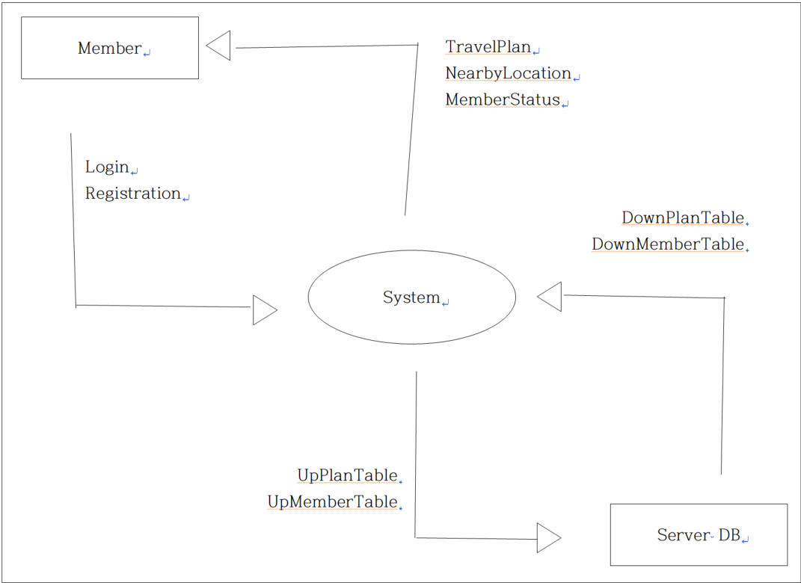

1\. Conceptualization

TravPlanner - 여행 플래너

(Logo) - option

22110367

김기현

<22110367@ynu.kr>

\[ Revision history \]

| **Revision date** | **Version #** | **Description** | **Author** |
| ----------------- | ------------- | --------------- | ---------- |
| 03/23/2026        | 0.2           |                 |            |
|                   |               |                 |            |
|                   |               |                 |            |
|                   |               |                 |            |
|                   |               |                 |            |
|                   |               |                 |            |

\= Contents =

1\. Business purpose ..................................................................................

2\. System context diagram .......................................................................

3\. Use case list .........................................................................................

4\. Concept of operation ............................................................................

5\. Problem statement ................................................................................

6\. Glossary .................................................................................................

7\. References .................................................................................................

1\. Business purpose

- 여행을 다닐 때, 어떤 사람들은 Google Map에 장소를 저장하기도 하고, 어떤 사람들은 목적 없이 자유분방하게 돌아다니기도 하며, 어떤 사람들은 그때그때 장소를 찾아보며 다니기도 한다. 즉 여행을 위해서는 Map Application과 일정 관리 Application이 필요하며, 다수의 앱을 사용하며 넘나드는 과정에서 User들은 불편함을 느끼고, 앱별로 파편화된 일정 관리 때문에 놓치는 계획이 있을 수도 있으며, 여러 앱의 사용으로 인해 많은 시간을 소요하며 불필요한 여러 알림이 동시에 도착하여 여행의 본질을 잃을 수 있다. 이에 여행자들이 여행의 본질을 추구하고 복잡한 일정 때문에 앱에 쓰는 시간을 최소화하여 여행 그 자체에 최대한의 시간을 사용할 수 있도록 하는 것이 목적이다.
- 본 Application은 발명에서 결합의 IDEA, 지도+일정관리+알림 기능을 하나로 통합하여 세계 곳곳을 탐험하는 여행자들에게 스마트 기기에는 최소한의 시간을 투자하게 하고, 최대한 많은 시간을 여행에 보장할 수 있도록 심플하면서도 통합적인 여행 맞춤 일정 관리 기능을 제공하는 것을 목적으로 한다.

2\. System context diagram

Login : 로그인

Registration : 회원가입

TravelPlan : 여행 일정

NearbyLocation : 주변 둘러보기

MemberStatus : 유저 정보

UpPlanTable : 여행 일정 저장하기

DownPlanTable : 여행 일정 불러오기

UpMemberTable : 유저 정보 저장하기

DownMemberTable : 유저 정보 불러오기

3\. Use case list

1. Login

| Actor       | User                               |
| ----------- | ---------------------------------- |
| Description | 고객이 자신의 아이디로 로그인한다. |

2)Register

| Actor       | User                                                                                                              |
| ----------- | ----------------------------------------------------------------------------------------------------------------- |
| Description | 자신의 아이디로 로그인한다. 시스템은 DB Server에게 Login 정보를 주고 회원 정보를 받아 Login 성공 여부를 반환한다. |

3)Log-out

| Actor       | User                                                           |
| ----------- | -------------------------------------------------------------- |
| Description | Log-out한다. 개인정보 보호를 위해 완전히 첫 화면으로 돌아간다. |

4)여행 일정 등록

| Actor       | User                         |
| ----------- | ---------------------------- |
| Description | 유저의 여행 일정을 등록한다. |

5)여행 일정 조회

| Actor       | Customer, Manager                                                                                    |
| ----------- | ---------------------------------------------------------------------------------------------------- |
| Description | DB를 가져와 현재 시간에 진행 중인 여행 일정을 확인하고, 현재 일정 완료 후 다음 일정도 같이 보여준다. |

6)여행 일정 삭제

| Actor       | Customer, Manager                                    |
| ----------- | ---------------------------------------------------- |
| Description | 유저의 여행 일정 중 삭제를 요구받은 일정을 삭제한다. |

7)주변 둘러보기

| Actor       | Customer, Manager                                                                           |
| ----------- | ------------------------------------------------------------------------------------------- |
| Description | 기기의 위치 권한을 획득하여 Google Map의 API를 이용, 현 위치 주변에 있는 장소들을 추천한다. |

4\. Concept of operation

1. Login

| Purpose  | 앱을 사용하기 위해 등록된 사용자인지 확인                                                                                                                                                                                   |
| -------- | --------------------------------------------------------------------------------------------------------------------------------------------------------------------------------------------------------------------------- |
| Approach | 사용자가 앱을 실행 후 로그인 시, ID, PW를 입력 후 로그인을 요청하면 서버에서 회원 정보를 조회 후 로그인 성공/실패 여부 확인한다. 없는 ID,PW거나 회원 목록 리스트 테이블에 있는 것과 일치하지 않다면 에러 메시지를 출력한다. |
| Dynamics | 앱 실행 시 로그인할 경우                                                                                                                                                                                                    |
| Goals    | 로그인 기능을 구현한다.                                                                                                                                                                                                     |

2)Register

| Purpose  | 앱을 사용하기 위한 사용자로 등록                                                              |
| -------- | --------------------------------------------------------------------------------------------- |
| Approach | 사용자에게서 이메일, ID, Password를 입력받은 후, 중복이 아니라면 그것을 Server DB에 추가한다. |
| Dynamics | 앱 실행 시 사용자 계정이 없을 경우                                                            |
| Goals    | 회원가입 기능을 구현한다.                                                                     |

3)Log-out

| Purpose  | 접속되어있는 사용자의 Session에서 탈출하여 초기화면(Login Screen)으로 Return |
| -------- | ---------------------------------------------------------------------------- |
| Approach | 사용자의 Session에서 나가 Login Screen으로 되돌아간다.                       |
| Dynamics | 개인정보 보호를 위하여 로그아웃하는 상황                                     |
| Goals    | 로그아웃 기능을 구현한다.                                                    |

4)여행 일정 등록

| Purpose  | 일정 리스트에 여행 일정을 추가하는 기능                                                                                                      |
| -------- | -------------------------------------------------------------------------------------------------------------------------------------------- |
| Approach | 여행 일정 조회 화면에서 '등록' 버튼을 누르면 여행 일정을 추가할 수 있는 화면이 나타난다. 제목, 메모, 지도(Google Map API 활용)으로 구성된다. |
| Dynamics | 여행 일정을 앱에 추가하고 싶을 경우                                                                                                          |
| Goals    | 여행 일정을 앱에 추가하여 유저의 여행 계획을 보조한다.                                                                                       |

5)여행 일정 조회

| Purpose  | 일정 리스트에서 여행 일정을 조회하는 기능                                                                                                    |
| -------- | -------------------------------------------------------------------------------------------------------------------------------------------- |
| Approach | 로그인 후 바로 뜨는 Main Screen으로, 상단에는 현재 진행 중인 일정과 그 다음 진행해야 할 일정이 표시되며, 하단에는 전체 일정 목록이 표시된다. |
| Dynamics | 여행 일정을 조회하며 여행 계획을 검토하고 확인할 때                                                                                          |
| Goals    | DB에 등록된 여행 일정을 표시하여 유저가 여행에 대해 다각적으로 검토할 수 있도록 쉽게 표시한다.                                               |

6)여행 일정 삭제

| Purpose  | 일정 리스트에서 여행 일정을 삭제하는 기능                                                                                                                                        |
| -------- | -------------------------------------------------------------------------------------------------------------------------------------------------------------------------------- |
| Approach | 여행 일정 조회 화면에서 휴지통 아이콘을 누르거나 일정 리스트에서 상호작용 시 여행 일정을 삭제할 수 있다. 휴지통 아이콘을 누를 시에는 여러 개의 리스트를 선택하여 삭제할 수 있다. |
| Dynamics | 여행 일정을 삭제하고 싶을 때                                                                                                                                                     |
| Goals    | 유저의 검토 결과 불필요한 일정이 있거나 또는 오입력한 일정이 있을 때 빠르게 삭제하게 하여 여행 시 잘못된 일정으로 진행되지 않게 막아준다.                                        |

7)주변 둘러보기

| Purpose  | 현재 위치에서 주변의 추천 여행지를 알려주는 기능                                                                                          |
| -------- | ----------------------------------------------------------------------------------------------------------------------------------------- |
| Approach | 여행 일정 조회 화면에서 지도 아이콘을 누르면 기기의 위치 권한을 획득 후 Google Map의 API를 활용하여 주변에 있는 여행지들을 추천하여 준다. |
| Dynamics | 현 위치 주변에서 미리 예상하지 못한 식사 등의 여행 일정을 진행하려고 할 때                                                                |
| Goals    | 천재지변 등 상황으로 갑작스럽게 여행 일정이 변경되어야 하는 상황일 때 현 위치 주변에서 할 수 있는 일을 알려준다.                          |

5\. Problem statement

TravPlanner는 여행을 다니는 유저가 여행 일정을 쉽게 관리하고 주변의 정보를 쉽게 알 수 있게 해주는 프로그램이다. 그러나 하술하는 특징들로 인하여 이 프로그램에는 여러 가지 Problem Statement가 있을 수밖에 없다. 이를 설명한다.

1.여행 일정은 컴퓨터로도, 휴대폰으로도 짤 수 있기 때문에 Multi Platform 지원이 필수적이며, 여러 운영체제를 지원해야 한다. 한정된 플랫폼으로는 사용자들의 유입이 적을 수밖에 없다.

2.유저에게 적시에 일정 알림을 보내기 위해서는 별도의 스마트 웨어러블 기기용 앱이 요구될 수도 있다.

6\. Glossary

애플리케이션 : 사용자들이 실제로 서비스를 이용하기 위한 응용프로그램

위치 서비스 : 사용자의 위치를 기반으로 하는 서비스

API : Application Programming Interface, 응용 프로그램에서 사용할 수 있도록, 운영체제나 프로그래밍 언어가 제공하는 기능을 제어할 수 있게 만든 인터페이스

7\. References

Google Maps API - <https://mapsplatform.google.com/lp/maps-apis/>
